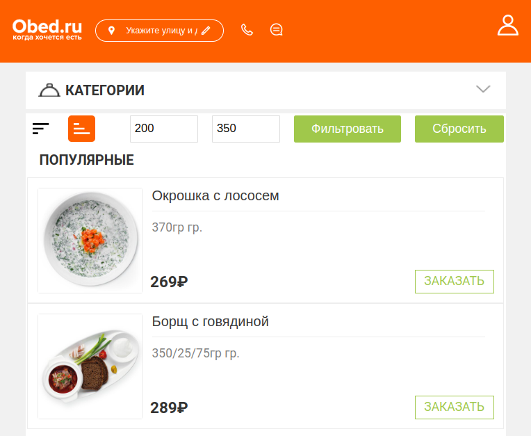

# О расширении

**Obed Filter** - это **расширение** для браузера **Google Chrome**, добавляющие на страницы меню ресторанов сайта [obed.ru](https://www.obed.ru/) следующее:

* 💰 Фильтрацию обедов по стоимости
* 📶 Сортировку по возрастанию/убыванию стоимости товара
* 🔼 Кнопку "Вверх"

_Данное расширение разрабатывалось в рамках знакомства с объектом Proxy в JavaScript_

---

## Локальная установка проекта

Сборка проекта выполняется с помощью [Parcel](https://parceljs.org/).

1. Клонировать репозиторий: `git clone https://github.com/312-s/obed-filter.git`
2. Перейти в директорию проекта
3. Установить зависимость: `npm i`
4. Запустить сборку: `npm run start`

После этого запуститься сборка проекта. Собранные файлы будут находиться в `dist` директории, именно эту папку нужно загружать в качестве распаковочного расширения.

Более подробной со сборкой расширений можно ознакомиться в [официальной документации](https://parceljs.org/recipes/web-extension/).

## Сборка

Командой `npm run build` выполняется итоговая сборка расширения в папку `releas`. При генерации `.crx` файла нужно указывать путь до этой директории. 
